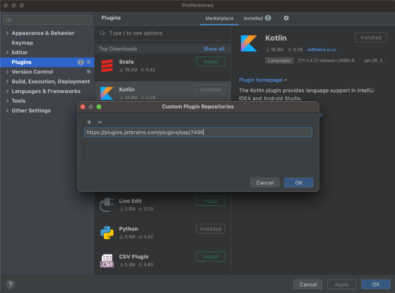
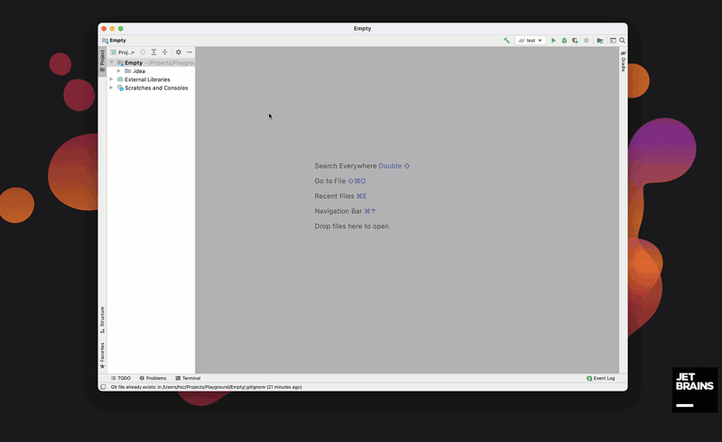
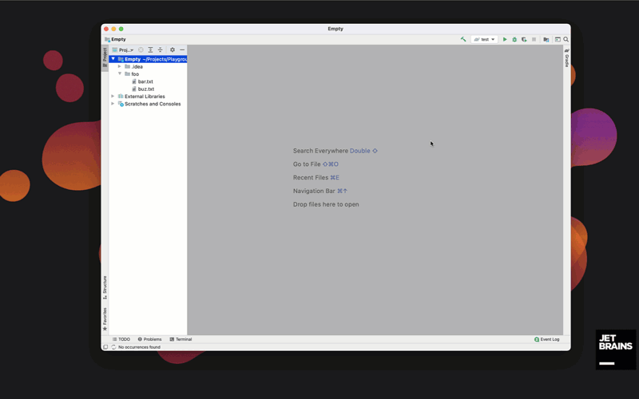

.ignore 4.0.3
=============

[][jb:confluence-on-gh]
[][gh:build]

[][plugin-website]
[][plugin-website]
[][plugin-website]

Introduction
------------

<!-- Plugin description -->

**.ignore** is a plugin for:

- `.gitignore` (Git)
- `.hgignore` (Mercurial)
- `.npmignore` (NPM)
- `.dockerignore` (Docker)
- `.chefignore` (Chef)
- `.cvsignore` (CVS)
- `.bzrignore` (Bazaar)
- `.boringignore` (Darcs)
- `.mtn-ignore` (Monotone)
- `ignore-glob` (Fossil)
- `.jshintignore` (JSHint)
- `.tfignore` (Team Foundation)
- `.p4ignore` (Perforce)
- `.flooignore` (Floobits)
- `.eslintignore` (ESLint)
- `.cfignore` (Cloud Foundry)
- `.jpmignore` (Jetpack)
- `.stylelintignore` (StyleLint)
- `.stylintignore` (Stylint)
- `.swagger-codegen-ignore` (Swagger Codegen)
- `.helmignore` (Kubernetes Helm)
- `.upignore` (Up)
- `.prettierignore` (Prettier)
- `.ebignore` (ElasticBeanstalk)
- `.gcloudignore` (Google Cloud)

files in your project. It supports the following IDEs:

- Android Studio
- AppCode
- CLion
- IntelliJ IDEA
- PhpStorm
- PyCharm
- RubyMine
- WebStorm
- DataGrip

Features
--------

- Files syntax highlight
- Templates filtering and selecting in rules generator by name and content
- User custom templates
- Show ignored files by specified Gitignore file (right-click on `.gitignore` file)
- Create a file in the currently selected directory
- Generate Gitignore rules basing on [GitHub's templates collection][github-gitignore]
- Add a selected file/directory to Gitignore rules from the popup menu
- Suggesting `.gitignore` file creation for a new project
- Entries inspection (duplicated, covered, unused, incorrect syntax, relative entries) with quick-fix actions
- Comments and brackets support
- Navigation to entries in Project view
- Renaming entries from a dot-ignore file
- Close opened ignored files action
- Custom user templates with import/export features

<!-- Plugin description end -->

Supported IDEs
--------------

Since `v4.0.0`, .ignore plugin updates will be delivered only to the latest stable IDE version.

No worries! It means .ignore for all IDE version from before - `139-193` - will be frozen at `v3.x.x`.

Installation
------------

- Using IDE built-in plugin system:
    - <kbd>Preferences</kbd> > <kbd>Plugins</kbd> > <kbd>Browse repositories...</kbd> > <kbd>Search for ".ignore"</kbd> > <kbd>Install Plugin</kbd>
- Manually:
    - Download the [latest release][latest-release] and install it manually using <kbd>Preferences</kbd> > <kbd>Plugins</kbd> > <kbd>Install plugin from disk...</kbd>

Restart IDE.

EAP
---
If you are working with IDEs in EAP version, like IntelliJ 2021.1 EAP, there is `eap` channel introduced to provide the `.ignore` plugin updates supporting such versions.

To enable EAP updates of the `.ignore` plugin, add the `https://plugins.jetbrains.com/plugins/eap/7495` URL in the IDE settings:

<kbd>Preferences</kbd> > <kbd>Plugins</kbd> > <kbd>Manage Plugin Repositories...</kbd>

Usage
-----

1. Generate a new file and templates usage

   To generate new ignore file, just click on <kbd>File</kbd> > <kbd>New</kbd> or use <kbd>Alt</kbd> + <kbd>Insert</kbd> shortcut and select `.ignore file` element.

   

2. Support for typing new rules, linking rules with matched files

   

3. Code inspections

   Code inspections covers few cases:

    - duplicated entries (checks if entry is defined more than once)
    - covered entries - entry is covered by more general one
    - unused entries
    - incorrect syntax (regexp rules)
    - relative entries

   

[github-gitignore]:    https://github.com/github/gitignore
[plugin-website]:      https://plugins.jetbrains.com/plugin/7495
[latest-release]:      https://github.com/JetBrains/idea-gitignore/releases/latest

[jb:confluence-on-gh]: https://confluence.jetbrains.com/display/ALL/JetBrains+on+GitHub
[gh:build]:            https://github.com/JetBrains/idea-gitignore/actions?query=workflow%3ABuild
